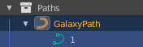
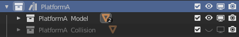

# Mario Galaxy Map Editor / Converter Addon for Blender
Transforms Blender into a Mario Galaxy Level Editor.
Still pretty WIP. Make backups of your levels.

# Preparation

- Download GALAXYMAP_EDITOR-ASSETS.blend file
- Install [Pymap](https://github.com/SunakazeKun/pyjmap)
- Download [WiiExplorer](https://github.com/SuperHackio/WiiExplorer)
- Download [LaunchCamPlus](https://github.com/SuperHackio/LaunchCamPlus) (optional)
- Download the text files and place these in the same directory as the WiiExplorer.exe

Now start Blender and install the addon
- In the 3D View on the right click on the *Mario Galaxy* tab enter the required paths at the *path* column

# Importing Levels

Before doing anything, save your Blender file.

You can import full galaxies and/or individual zones. Simply enter the zone or galaxy name and click on Import Galaxy or Import Zone.
If **Asset Searching Enabled** is set to 1, the plugin searches for assets in a given folder structure using the levels object names in Blender files and links them. More about this at **Asset Usage**.

# Exporting Levels

If you click on **Export Galaxy**, all zones will be exported and saved into your StageData filesystem. To export a single zone, select the collection with the zone name and click on **Export Zone**

Your blender file needs to be saved in order to do this.
# Creating new levels

To create a brand new level, start with a new Blender file and click on **Create brand new galaxy**. This creates a new scene with a new scenario and a main zone. Now you can add several new zones with **Create new Zone**.

## Scenario Editing

In Blender, each scenario is divided into scenes. To edit scenario settings, go to the **Mario Galaxy -Scenario** tab under **Mario Galaxy** right in the 3D View.

- **ScenarioNo** The Mission ID
- **ScenarioName** A custom name useful for editing (ignored by the game)
- **ScenarioType** *Normal* for normal mission, *Hidden* for hidden star, part of another normal mission
- **Power Star Trigger** Name of an actor that spawns the mission's star
- **Comet** Type of comet for this mission
- **Comet Time Limit** In seconds
- **LuigiModeTimer** Unused
- **StarMask** This defines which stars from 1-6 are active, inactive. As of this version, its just displayed as a hash number, so get [this tool](https://kuribo64.net/get.php?id=0WxWiGQe9elhns2b) to get the correct values.

**Zone Layer Display**
Select a zone's collection in the outliner to display which layers should be visible. If the zone does not have an entry in the scenario yet, a buttom appears that will do the job.

Like Star Mask, its just displayed as a hash number as of this version, so get [this tool](https://kuribo64.net/get.php?id=0WxWiGQe9elhns2b) to get the correct values.

## Editing

### Adding objects
To add objects, be sure that you selected the zone's collection, which you want to add your object, and click on **Add Galaxy Object** to add an object of your likeling. If Asset Searching is enabled, the plugin searches for assets in a given folder structure using your entered object name in Blender files and links them. More about this at **Asset Usage**.

Once a type is selected, Blender will probably freeze briefly. If this is the case, an object name must be entered. Go to Blender's Command Line window and enter your object name. (Sorry, I don't understand how to do this with Blender's UI :P, Will probably be replaced later anyway with a selection from the ObjectDatabase) 

### Editing objects
Select an object and go to the *Mario Galaxy - Object Settings* tab to get all editable parameters of the selected objects such as object aruments, area shapes, gravity sizes, and more.

You will also find an **Alternative Name** string. If you enter an name here, the exporter will ignore the actual object name and will use this one instead. This is required if you have multiple objects with the same name, as Blender's outliner can not store the same object name (adds an .001 to the name). When adding objects, it adds an name in this field by default.

### Paths

Paths can have parameters per point, so to edit these, go to editing mode and select the point, then go to the *Item* tab to the *Transform* column:
- **Mean Tilt** The point speed (arg 0)
- **Mean Radius** The point stop value (arg5), but in the formula Y.XXXX (XXXX is the actual speed, Y sets, if it is enabled at all: 1 = false, 0 = true)

To get more point settings for an ordinary path, click on **Path** under *Point Settings* under *Mario Galaxy - Object Settings*. This will ad an geometry node you can set in the paths modifer settings. Set *PointID* and the modifier name to the point you want to have the settings (a marker will be visible in the 3D View)

The Path ID is defined here. If you add a new path, you must enter a new ID here:

### Layer Editing

Each object, except paths, has an Layer field to control, in which scenario it is there and in which not. Set either **Common** for always being there, or LayerA - LayerP. Blender will not update the visibility immediately, so click on **Update Layer Info** in the *Mario Galaxy- Map Tools* tab

### Camera Editing

Select a zone's collection and click on **Start Camera Editor** in the *Mario Galaxy- Map Tools* tab. Be sure that you entered LaunchCamPlus' folder path unter *paths*.

### Asset Usage

To use loadable model assets in the editor, you must put your 3D model into a collection and give this collection the object name to be used. If your model contains additional things that should not be visible in the editor, such as collision, deactivate the visibility in the viewport of the model/collection (via the monitor icon). Then right-click on the collection and click on **Mark As Asset**.

If you now add an object with the same name, or import a zone/galaxy that contains this object name, the 3D model will now be visible when:
-The asset is in the same blend file as the level
or
-The blend file with the asset is in the folder structure that was entered in *paths* under *Mario Galaxy - Map Tools*

#### Blender's Asset Browser

Your asset is then of course also in Blender's Asset Browser and you can drag it from there into your level. The disadvantage (so far), however, is that it does not automatically contain the required properties. Click on **Add properties to selected asset (collection)** under *Mario Galaxy - Map Tools* and select either **General Object** or **Map Parts Object** to add the required parameters.

You also need to be sure that the object is in the correct category in the outliner. The Asset Browser will only add it to the currently selected collection!

